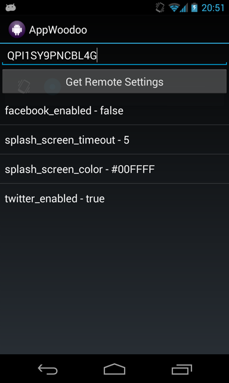

# Appwoodoo Android SDK

`v2.5.0`

Send push messages or remotely configure your app without resubmitting it to Google Play or the App Store. Conduct A/B tests or control any behaviour from the air. **We give you the server and awesome open source SDKs.**

## Quick Install

1. Make sure you have Google Play Services and the Appwoodoo package included in your project. It's as simple as adding these two lines to your app-Gradle build:

```java
dependencies {
    compile 'com.google.android.gms:play-services:8.3.0'
    compile 'com.appwoodoo:appwoodoo:2.5.0'
    ...
}
```

If the jCenter repository is not included yet, add it in the same build file:

```java
repositories {
    jcenter()
    ...
}
```

## Update from previous versions

* When updating to Appwoodoo SDK v2.4.1 or later:

Make sure to remove the Appwoodoo.jar file from the libs, and use only Gradle to compile the SDK (see the 'Quick Install' part).

If you still want to use the old jar distribution, please just use the previous version v2.3.1

* Nothing to do when updating to Appwoodoo SDK v2.3 from v2.2.

* If you are updating to Appwoodoo SDK v2.2 or later from v2.1 and previous versions, these are the only two steps needed:

    1. Integrate Google Play Services if you don't have it added yet. Feel free to remove the deprecated GCM device library at this point.

    2. Change the AndroidManifest.xml to include the new services and receivers. No new permissions are needed.

## Integrating the SDK

### Quick start with the Remote Settings

1. Get an API key on the website: [www.appwoodoo.com](http://www.appwoodoo.com/), and add some remote settings (for example, set "SPLASH_SCREEN_ENABLED") to "false")

2. Add the following permissions to the AndroidManifest.xml of your app:

   ```xml
   <uses-permission android:name="android.permission.INTERNET"/>
   ```

3. Add the takeOff call in the onCreate method of the first Activity:

   ```java
   Woodoo.takeOff("YOUR_API_KEY");
   ```

4. Receive the Remote Settings in your app:

   ```java
   Woodoo.getBooleanForKey("SPLASH_SCREEN_ENABLED");
   ```

### Quick start with Android Push Notifications

1. Go to the Google API Console to obtain the Google Cloud Messaging API Key. For more help, you can follow our [Android Push Message guide](http://www.appwoodoo.com/help/android-push-message/).

2. Once you have the API Key and your app's Project Number ready, you can pass these on within the setupPushNotifications() function, after the Woodoo takeOff:

    ```java
    // AppWoodoo take off as usual 
    Woodoo.takeOff("YOUR_API_KEY"); 

    // Push notifications setup 
    Woodoo.pushNotifications().setupPushNotification(this, "YOUR_GCM_PROJECT_NUMBER",
        "The title of the notifications", R.drawable.notification_icons); 

    // Remove all previous notifications on app start 
    Woodoo.pushNotifications().removeAll(getApplicationContext());
    ```

3. Modify your project's AndroidManifest.xml to catch incoming push notifications.

    First, the permissions section `(don't forget to replace the YOUR_APP_PACKAGE_NAME strings)`:

    ```xml
    <permission android:name="YOUR_APP_PACKAGE_NAME.permission.C2D_MESSAGE" android:protectionLevel="signature" />
    <uses-permission android:name="YOUR_APP_PACKAGE_NAME.permission.C2D_MESSAGE"/>
    <uses-permission android:name="com.google.android.c2dm.permission.RECEIVE" />
    <uses-permission android:name="android.permission.WAKE_LOCK"/>
    ```

    Then, within the Application node:

    ```xml
    <receiver
        android:name="com.google.android.gms.gcm.GcmReceiver"
        android:exported="true"
            android:permission="com.google.android.c2dm.permission.SEND" >
        <intent-filter>
            <action android:name="com.google.android.c2dm.intent.RECEIVE" />
            <action android:name="com.google.android.c2dm.intent.REGISTRATION" />
            <category android:name="com.appwoodoo.sdk" />
        </intent-filter>
    </receiver>

    <service android:name="com.appwoodoo.sdk.push.WoodooGcmListenerService" android:exported="false" >
        <intent-filter>
            <action android:name="com.google.android.c2dm.intent.RECEIVE" />
        </intent-filter>
    </service>

    <service android:name="com.appwoodoo.sdk.push.WoodooRegistrationIntentService" android:exported="false"/>

    <service android:name="com.appwoodoo.sdk.push.WoodooInstanceIDListenerService" android:exported="false">
        <intent-filter>
            <action android:name="com.google.android.gms.iid.InstanceID"/>
        </intent-filter>
    </service>
    ```

### Some more functions

* Pro Tip: if you only want to use push notifications, you can call the following function _instead_ of setupPushNotification(), remove Woodoo.takeOff and that way skip the background networking at every app start:

    ```java
    // Push notifications setup 
Woodoo.pushNotifications().setupPushNotificationWithoutRemoteTakeoff("YOUR_API_KEY", this, "YOUR_GCM_PROJECT_NUMBER",
        "The title of the notifications", R.drawable.notification_icons); 
    ```

* Check whether the settings have arrived from the server:

   ```java
   if (Woodoo.settingsArrived()) {
     Woodoo.getBooleanForKey("SPLASH_SCREEN_ENABLED");
   }
   ```

* Use a WoodooDelegate to be notified when the Remote Settings arrive:

   ```java
   public class MainActivity extends Activity implements WoodooDelegate {

     @Override
     protected void onCreate(Bundle savedInstanceState) {
       super.onCreate(savedInstanceState);
       Woodoo.takeOffWithCallback("YOUR_API_KEY", delegate);
     }
  
     @Override
     public void woodooArrived(Woodoo.WoodooStatus status) {
       if (status == Woodoo.WoodooStatus.SUCCESS) {
         System.out.println("WOODOO SETTINGS ARRIVED");
       }
     }

   }
   ```

* Disable receiving push notifications

```java
Woodoo.pushNotifications().disablePushNotifications(getApplicationContext());
```

* Re-enable push notifications

```java
Woodoo.pushNotifications().reEnablePushNotifications(getApplicationContext());
```

* Check whether the user has enabled receiving push notifications

```java
Woodoo.pushNotifications().pushNotificationsEnabled(getApplicationContext());
// Returns a boolean
```

## Try it out first

You can find an example application in the 'Example' folder. Open it with Android Studio and run it on any device with Google Play Services enabled. This app is for testing out Appwoodoo - simply register on the website, get an API key, and check what remote settings are available for your app.

   

## Advanced: build your own SDK

To give you full control over your Android application, we provide you the source code of this project as well as a drop-in SDK package. You can therefore build your own Appwoodoo SDK using Gradle build.

You can modify the SDK file, and then run the following script to generate a new package:

```sh
$ ./gradlew install
```

If you have access to appwoodoo's Bintray account, set the api_key in the local.settings, and you can upload this package to jCenter right away:

```sh
$ ./gradlew bintrayUpload
```

## About

Appwoodoo is a service proudly built by [Tamas Dancsi](http://www.tamasdancsi.com/) and [Richard Dancsi](http://www.wimagguc.com/).

Please feel free to contribute: push back your improvements, or just send an e-mail to info-AT-appwoodoo.com with your ideas and suggestions. Special thanks to [@sianis](https://github.com/sianis/) for already having done so.

Built in [Google Campus](http://www.campuslondon.com/) of London, [Betahaus](http://www.betahaus.de/) of Berlin and in several parks and cafes of Vienna.

## Lincese

Lincesed under The MIT License (MIT)

Copyright (c) 2013-2015 Appwoodoo ([appwoodoo.com](www.appwoodoo.com))

Permission is hereby granted, free of charge, to any person obtaining a copy
of this software and associated documentation files (the "Software"), to deal
in the Software without restriction, including without limitation the rights
to use, copy, modify, merge, publish, distribute, sublicense, and/or sell
copies of the Software, and to permit persons to whom the Software is
furnished to do so, subject to the following conditions:

The above copyright notice and this permission notice shall be included in
all copies or substantial portions of the Software.

THE SOFTWARE IS PROVIDED "AS IS", WITHOUT WARRANTY OF ANY KIND, EXPRESS OR IMPLIED, INCLUDING BUT NOT LIMITED TO THE WARRANTIES OF MERCHANTABILITY,
FITNESS FOR A PARTICULAR PURPOSE AND NONINFRINGEMENT. IN NO EVENT SHALL THE
AUTHORS OR COPYRIGHT HOLDERS BE LIABLE FOR ANY CLAIM, DAMAGES OR OTHER
LIABILITY, WHETHER IN AN ACTION OF CONTRACT, TORT OR OTHERWISE, ARISING FROM,
OUT OF OR IN CONNECTION WITH THE SOFTWARE OR THE USE OR OTHER DEALINGS IN
THE SOFTWARE.
