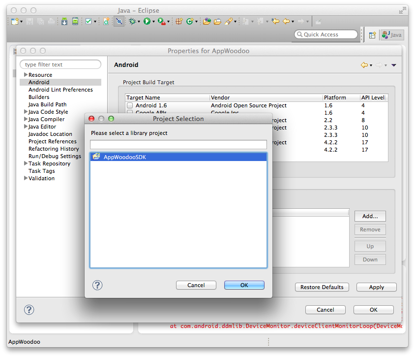

# AppWoodoo Android SDK

`v2.0`

Send push messages or remotely configure your app without resubmitting it to Google Play or the App Store. Conduct A/B tests or control any behaviour from the air. **We give you the server and awesome open source SDKs.**

In this package you will find the open source AppWoodoo Android SDK together with an example app to try it all out. (Scroll down to see how.)

## This is a semi-release package

This package contains all the necessary code and is a working solution. However, I've been using the deprecated Google Cloud Messaging device support JAR, and so will want to move to be using Google Play services soon.

Furthermore, the code needs some cleanup and I've been lazy with the documentation as well. These shall be updated, though those changes supposed to be non-breaking.

## Install

To give you full control over your Android application, we provide you the source code of this project as well as a drop-in SDK package. You can therefore add the AppWoodoo SDK either as a Library project, or as a jar file.

Before you start, make sure you have the Google Cloud Messaging device support SDK added to your project. Here is a [download link](https://code.google.com/p/gcm/source/browse/gcm-client-deprecated/dist/gcm.jar).

1. As an SDK

   Simply drag & drop the AppWoodooSDK.jar file to the libs folder of your project in Eclipse; or

2. As a Library project

   In Eclipse, right-click on the project name in the left panel. In the Application properties, navigate to Android, add a new Library, select AppWoodooSDK and click Save.

   

## Integrating the SDK

### Quick start with the Remote Settings

1. Get an API key on the website: [www.appwoodoo.com](http://www.appwoodoo.com/), and add some remote settings (for example, set "SPLASH_SCREEN_ENABLED") to "false")

2. Add the following permissions to the AndroidManifest.xml of your app:

   ```
   <uses-permission android:name="android.permission.INTERNET"/>
   ```

3. Add the takeOff call in the onCreate method of the first Activity:

   ```
   Woodoo.takeOff("YOUR_API_KEY");
   ```

4. Receive the Remote Settings in your app:

   ```
   Woodoo.getBooleanForKey("SPLASH_SCREEN_ENABLED");
   ```

### Quick start with Android Push Notifications

1. Go to the Google API Console to set up Google Cloud Messaging API. For more help, you can follow our [Android Push Message guide](http://www.appwoodoo.com/help/android-push-message/).

2. Once you obtained the API key and your app's Project Number, you can pass these on within the setupPushNotifications() function, after the Woodoo takeOff:

    ```
    // AppWoodoo take off as usual 
    Woodoo.takeOff("YOUR_API_KEY"); 

    // Push notifications setup 
    Woodoo.pushNotifications().setupPushNotification(this, "YOUR_GCM_PROJECT_NUMBER",
        "The title of the notifications", R.drawable.notification_icons); 

    // Remove all previous notifications on app start 
    Woodoo.pushNotifications().removeAll(getApplicationContext());
    ```

3. Modify your project's AndroidManifest.xml to catch incoming push notifications.

    First, the permissions section (don't forget to replace the YOUR_APP_PACKAGE_NAME strings):

    ```
    <permission android:name="YOUR_APP_PACKAGE_NAME.permission.C2D_MESSAGE" android:protectionLevel="signature" />
    <uses-permission android:name="YOUR_APP_PACKAGE_NAME.permission.C2D_MESSAGE"/>
    <uses-permission android:name="com.google.android.c2dm.permission.RECEIVE" />
    <uses-permission android:name="android.permission.WAKE_LOCK"/>
    ```

    Then, within the Application node:

    ```
    <receiver android:name="com.appwoodoo.sdk.push.GCMReceiver" android:permission="com.google.android.c2dm.permission.SEND" >
        <intent-filter>
            <action android:name="com.google.android.c2dm.intent.RECEIVE" />
            <action android:name="com.google.android.c2dm.intent.REGISTRATION" />
            <category android:name="com.appwoodoo.sdk"/>
        </intent-filter>
    </receiver>
    <service android:name="com.appwoodoo.sdk.push.GCMIntentService"/>
    ```

### Some more functions

* Check weather the settings have arrived from the server, before using them:

   ```
   if (Woodoo.settingsArrived()) {
     Woodoo.getBooleanForKey("SPLASH_SCREEN_ENABLED");
   }
   ```

* Use a WoodooDelegate to be notified when the Remote Settings arrive:

   ```
   public class MainActivity extends Activity implements WoodooDelegate {

     @Override
     protected void onCreate(Bundle savedInstanceState) {
       super.onCreate(savedInstanceState);
       Woodoo.takeOffWithCallback("YOUR_API_KEY", delegate);
     }
  
     @Override
     public void woodooArrived(Woodoo.WoodooStatus status) {
       if (status == Woodoo.WoodooStatus.SUCCESS) {
         System.out.println("WOODOO SETTINGS ARRIVED");
       }
     }

   }
   ```

## Try it out first

You will find an example application in the 'Example' folder, which you can open and run with Eclipse. This app is for testing out AppWoodoo - simply register on the website, get an API key, and check what remote settings are available for your app.

   

## About

AppWoodoo is a free service, proudly built by [Tamas Dancsi](http://www.tamasdancsi.com/) and [Richard Dancsi](http://www.wimagguc.com/).

Please feel free to contribute: push back your improvements, or just send an e-mail to info-AT-appwoodoo.com with your ideas and suggestions. Special thanks to [@sianis](https://github.com/sianis/) for already having done so.

Built in [Google Campus](http://www.campuslondon.com/) of London, [Betahaus](http://www.betahaus.de/) of Berlin and in several parks and cafes of Vienna.

## Lincese

Lincesed under The MIT License (MIT)

Copyright (c) 2013 AppWoodoo ([appwoodoo.com](www.appwoodoo.com))

Permission is hereby granted, free of charge, to any person obtaining a copy
of this software and associated documentation files (the "Software"), to deal
in the Software without restriction, including without limitation the rights
to use, copy, modify, merge, publish, distribute, sublicense, and/or sell
copies of the Software, and to permit persons to whom the Software is
furnished to do so, subject to the following conditions:

The above copyright notice and this permission notice shall be included in
all copies or substantial portions of the Software.

THE SOFTWARE IS PROVIDED "AS IS", WITHOUT WARRANTY OF ANY KIND, EXPRESS OR IMPLIED, INCLUDING BUT NOT LIMITED TO THE WARRANTIES OF MERCHANTABILITY,
FITNESS FOR A PARTICULAR PURPOSE AND NONINFRINGEMENT. IN NO EVENT SHALL THE
AUTHORS OR COPYRIGHT HOLDERS BE LIABLE FOR ANY CLAIM, DAMAGES OR OTHER
LIABILITY, WHETHER IN AN ACTION OF CONTRACT, TORT OR OTHERWISE, ARISING FROM,
OUT OF OR IN CONNECTION WITH THE SOFTWARE OR THE USE OR OTHER DEALINGS IN
THE SOFTWARE.
